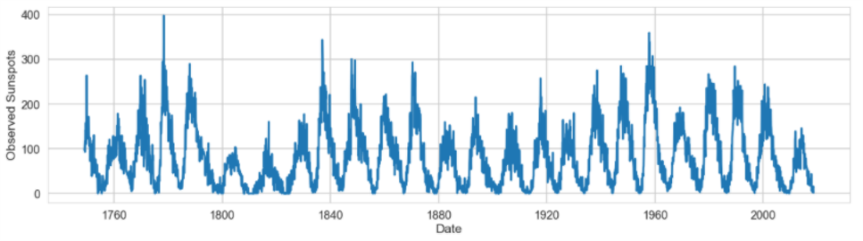
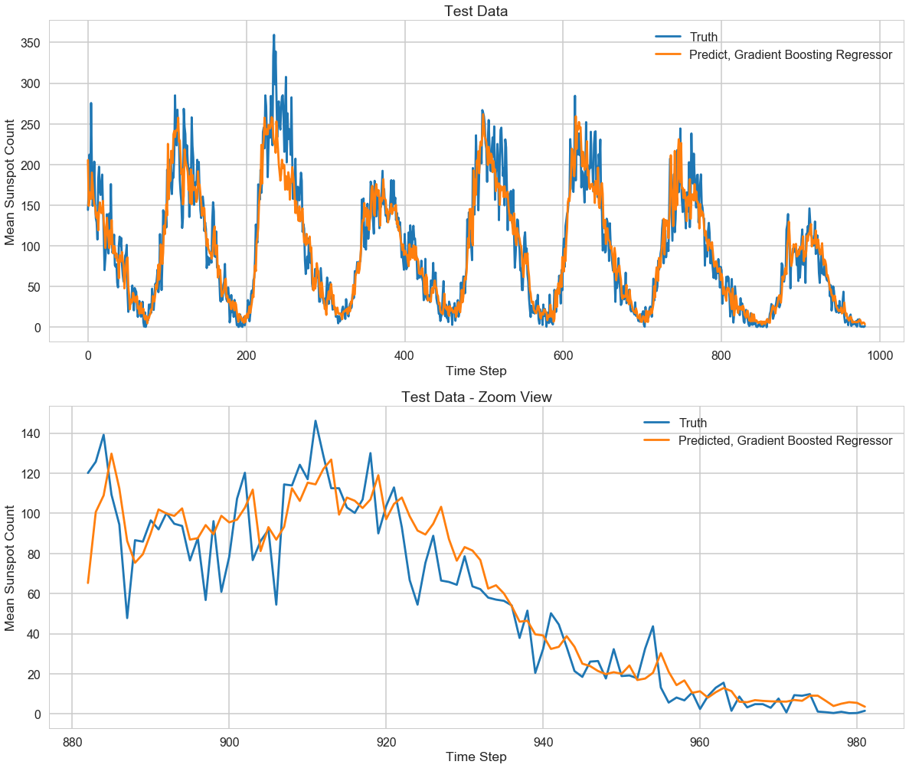

# time-series-forecasting-with-gradient-boosted-trees

We will forecast the solar cycle by predicting the number of sunspots that will appear next given
the past pattern of sunspot appearance.

Here is some interesting background on the solar cycle from wikipedia (https://en.wikipedia.org/wiki/Solar_cycle):

"The solar cycle or solar magnetic activity cycle is a nearly periodic 11-year change in the Sun's activity measured in terms of variations in the number of observed sunspots on the solar surface. Sunspots have been observed since the early 17th century and the sunspot time series is the longest continuously observed (recorded) time series of any natural phenomena."

"Accompanying the 11 year quasi-periodicity in sunspots, the large-scale dipolar (north-south) magnetic field component of the Sun also flips every 11 years; however, the peak in the dipolar field lags the peak in the sunspot number, with the former occurring at the minimum between two cycles. Levels of solar radiation and ejection of solar material, the number and size of sunspots, solar flares, and coronal loops all exhibit a synchronized fluctuation, from active to quiet to active again, with a period of 11 years."

"This cycle has been observed for centuries by changes in the Sun's appearance and by terrestrial phenomena such as auroras. Solar activity, driven both by the sunspot cycle and transient aperiodic processes govern the environment of the Solar System planets by creating space weather and impact space- and ground-based technologies as well as the Earth's atmosphere and also possibly climate fluctuations on scales of centuries and longer."

"Understanding and predicting the sunspot cycle remains one of the grand challenges in astrophysics with major ramifications for space science and the understanding of magnetohydrodynamic phenomena elsewhere in the Universe."

(describe basics of the data)

# Data Preparation and Model

We use the previous 500 observations to predict the next sunspot observation. The approximate pattern will repeat every 11 years (132 months), so 500 observations (41.67 years) will encompass several cycles. A better strategy than guessing at this is to treat the window as a hyperparameter and tune it based on model performance. We will explore this topic in a future notebook. 
The training set consists of the data observations from January 1749 to October 1929. The test data consists of the observations from November 1929 through December 2019. 

we created our X matrix of feature values (consisting in this case of mean counts of sunspots per year) and our y vector (the mean number of sunspots observed in the following year).

We set the number of trees (n_estimators) and the maximum depth of a given tree in the ensemble (max_depth) by hand (we will dive in on hyperparameter tuning strategies in a future notebook) and train a gradient boosted tree regression model from the scikit-learn library. The reason we name the model 'mid_model' will become clear later in the notebook.
N_ESTIMATORS = 100, MAX_DEPTH = 5.

# Results

Mean squared error is 750. More discussion . . . 